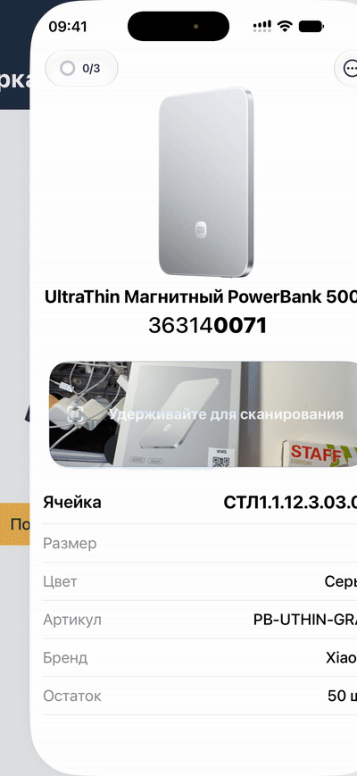
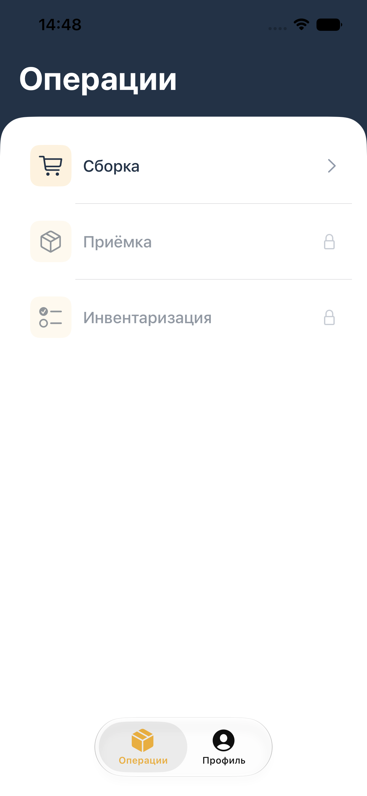
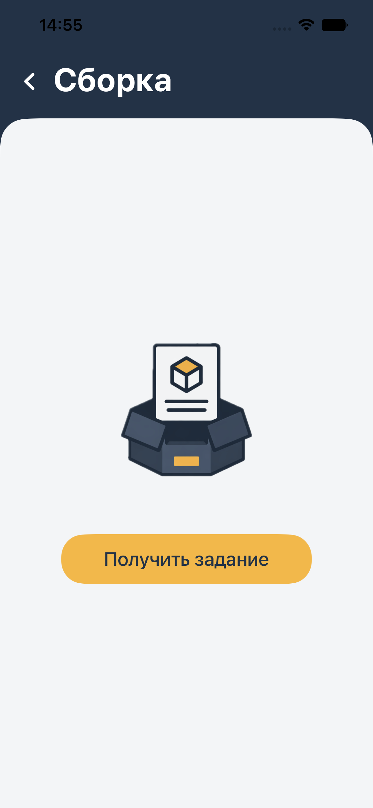
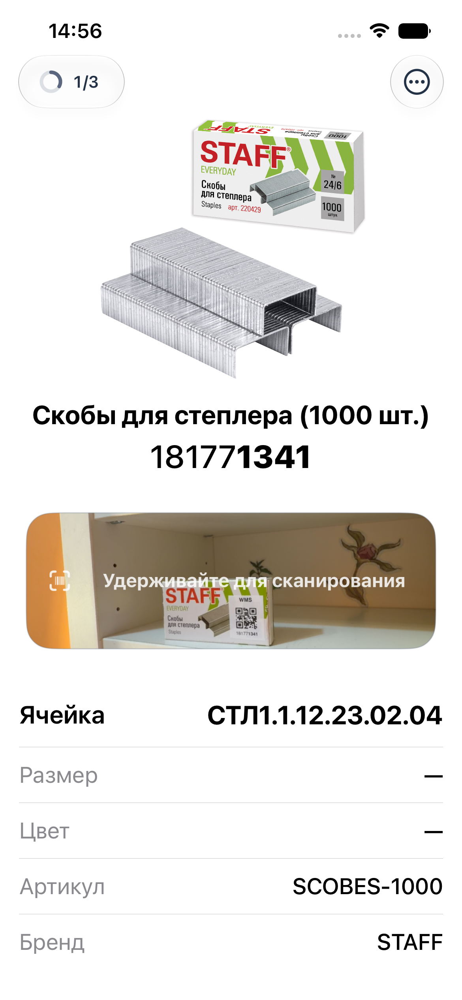
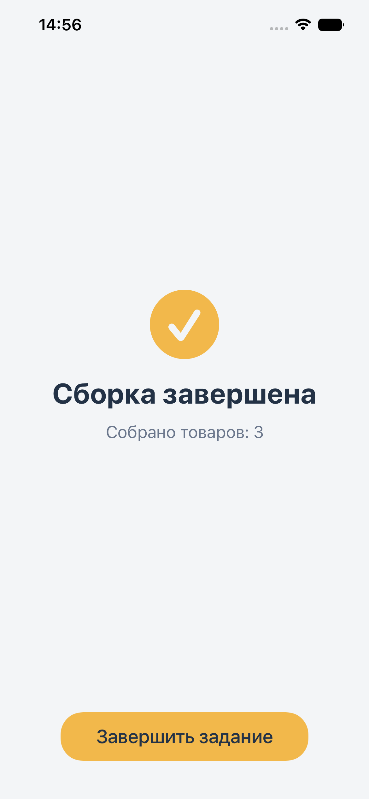
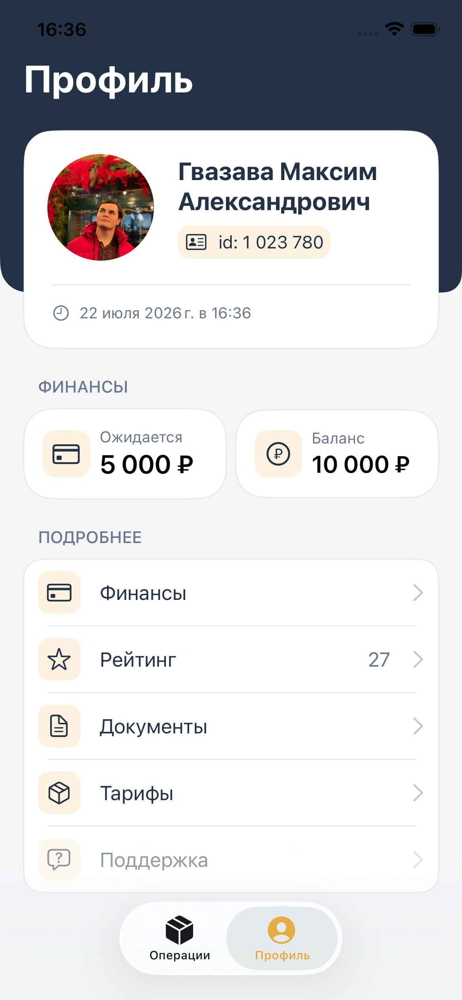
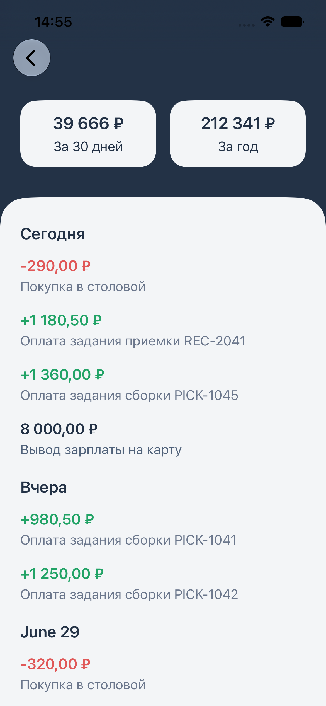
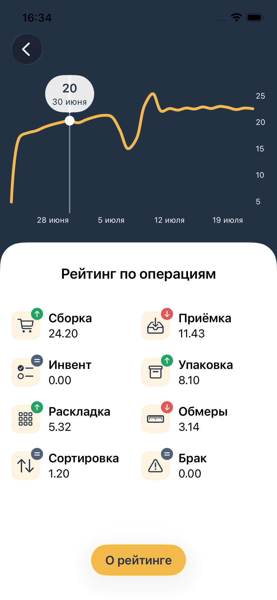
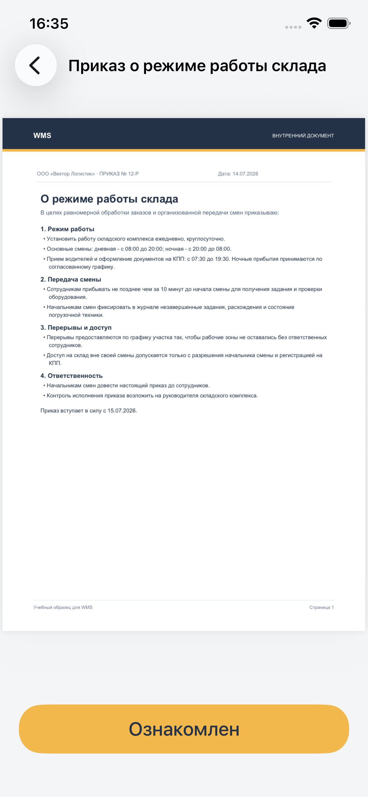
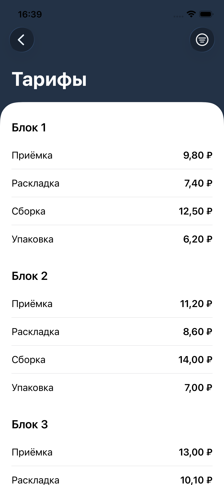

# WMS

<p align="center">
  
</p>

A mini warehouse management app built with SwiftUI. The current implementation focuses on a warehouse picking flow: an operator receives a task from API-style mock JSON, reviews a short onboarding flow, sees the current item, scans a numeric label code, handles missing or replacement items, moves to the next item, and finishes the task by encoding the result into an API-style JSON request.

Picking is the first implemented module. The app also includes a Profile tab with asynchronously loaded mock data and is designed to grow into a larger warehouse app with additional modules such as Receiving, Putaway, Inventory, and other warehouse operations.

## Project Status

In development. The Picking module is the most complete part of the app; Receiving, Putaway, Inventory, and other warehouse modules are planned.

## Screenshots

A demo GIF of the picking flow is shown above.

| Operations menu | Get task | Item & scanner |
|:---:|:---:|:---:|
|  |  |  |

| Task complete | Profile | Finance history |
|:---:|:---:|:---:|
|  |  |  |

| Rating | Documents | Tariffs |
|:---:|:---:|:---:|
|  |  |  |

## Features

### App

- Warehouse operations menu: Picking, Receiving, Inventory.
- Tab-based app shell with Operations and Profile sections.
- Navigation with `NavigationStack(path:)`.
- `@Observable` ViewModel.
- Camera permission blocker before warehouse operations, with first-run guidance and Settings recovery after denied access.

### Picking

- Picking flow: fetch task, onboarding, current item, scan, progress, finish screen.
- One-time illustrated Picking onboarding stored with `@AppStorage`, with replay from the task menu.
- AVFoundation scanner with camera preview embedded in SwiftUI.
- Scan area limited to the visible camera preview.
- Ultra wide camera selection when available, with fallback to the regular camera.
- Circular picking progress indicator in the navigation bar.
- Missing item flow with confirmation and skipped item summary.
- Replacement item mode for collecting an allowed analog item.
- API-style finish request encoding with collected, skipped, and replacement item IDs.
- Manual debug-only demo controls for testing successful and failed collection without the camera.

### Profile

- Profile screen with AsyncImage avatar, finance cards, reusable detail rows, support/settings placeholders, async mock loading, loading/error states, and pull-to-refresh.
- Rating screen with an interactive Swift Charts line chart, drag selection with a value callout, and a per-operation rating grid with trend indicators.
- Tariffs screen with rates grouped by warehouse zone and a popover filter by zone and operation.
- Documents screen with a PDFKit preview and an acknowledge action that updates the document state through the service.

### Shared and data

- Animated error banner in the navigation bar.
- System sound feedback for successful and failed scans.
- Shared temporary placeholder screen for modules and profile sections that are still in development.
- Mock API-style JSON resources for profile and picking task loading.
- Mock service for fetching tasks, validating replacements, encoding finish requests, and finishing picking tasks.
- Mock items with images, storage locations, articles, stock values, prices, and item attributes.
- Swift Testing coverage for core picking ViewModel/result behavior, Profile and Rating ViewModel loading states, and document acknowledgement.

## Main Flow

1. Open the Picking module.
2. Fetch a picking task.
3. Complete the Picking onboarding on first launch, or replay it from the task menu.
4. Check the item, label ID, and storage location.
5. Hold the camera area to scan.
6. If the scanned code matches the current item, the app moves to the next item.
7. If the item is missing, confirm the skip and continue.
8. If an allowed analog item is found, use replacement mode to collect it.
9. After all items are collected or skipped, the finish screen opens.
10. Finish the task through the mock service, which encodes the result into JSON.

## Tech Stack

- Swift
- SwiftUI
- MVVM
- Observation (`@Observable`)
- AVFoundation
- Swift Charts
- PDFKit
- Swift Testing
- Mock service layer with API-style JSON

## Project Structure

```text
WMS/
├── Features/
│   ├── Inventory/
│   ├── Operations/
│   ├── Picking/
│   │   └── PickingTask/
│   ├── Profile/
│   │   ├── Documents/
│   │   ├── Finance/
│   │   ├── Rating/
│   │   └── Tariffs/
│   └── Receiving/
├── Models/
│   ├── Operations/
│   ├── Picking/
│   └── Profile/
│       ├── Documents/
│       ├── Rating/
│       └── Tariffs/
├── Resources/
│   ├── Assets.xcassets/
│   ├── MockJSON/
│   └── MockPDF/
├── Services/
├── Shared/
│   └── Components/
└── Utilities/
```

Where to start reading:

- `PickingTaskView.swift` - Current item screen and scanner UI.
- `PickingTaskViewModel.swift` - Picking logic and code validation.
- `ScannerPreviewView.swift` - SwiftUI wrapper around the AVFoundation scanner.
- `PickingTaskService.swift` - Picking service protocol and mock implementation.
- `PickingTaskResultRequest.swift` - Encodable API-style request for finishing a picking task.
- `ProfileRatingView.swift` - Swift Charts rating chart with drag selection.
- `TariffsViewModel.swift` - Tariff loading, grouping by zone, and filtering.
- `DocumentPreviewView.swift` - PDF preview with the acknowledge action.
- `PDFKitView.swift` - SwiftUI wrapper around PDFKit.
- `MockJSONLoader.swift` - Helper for decoding bundled mock JSON resources.
- `WMSTests/` - Swift Testing suites for the Picking, Profile, Rating, and Documents ViewModels.

## How to Run

1. Open `WMS.xcodeproj` in Xcode.
2. Select an iPhone simulator or a physical device.
3. Use a physical iPhone to test the scanner, because the simulator does not provide a real camera.
4. Run the `WMS` target.

Minimum iOS version: iOS 17.

## Demo Guide

The repository includes a short picking demo guide with test item IDs and scanning instructions:

- [English demo guide](assets/Guide_Picking_Flow_EN.pdf)
- [Russian demo guide](assets/Guide_Picking_Flow_RU.pdf)

## Demo Notes

- The mock service includes a test user ID for checking the task fetching error state.
- Profile and picking task data are loaded from bundled mock JSON files.
- The picking finish flow encodes collected, skipped, and replacement item IDs into JSON before completing the mock request.
- Picking onboarding completion is stored locally with `@AppStorage`.
- The task menu includes debug-only demo controls and an onboarding replay action for local testing.
- Support and settings currently use a shared in-development placeholder.
- Camera permission handling blocks warehouse operations when camera access is missing.
- Receiving, Putaway, Inventory, and other warehouse operations are planned as future modules.

## Future Improvements

- Expand test coverage for scanner-related edge cases and navigation flows.
- Add an explicit empty task state.
- Add a camera switcher for 0.5x / 1x camera modes.
- Move camera permission blocking to an operation-tab overlay so the Profile tab remains available without camera access.
