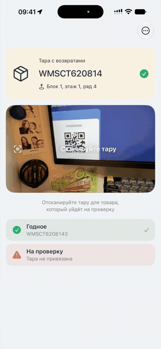
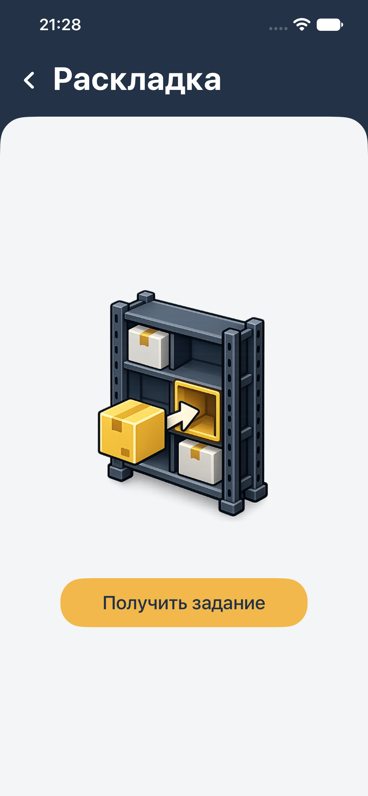
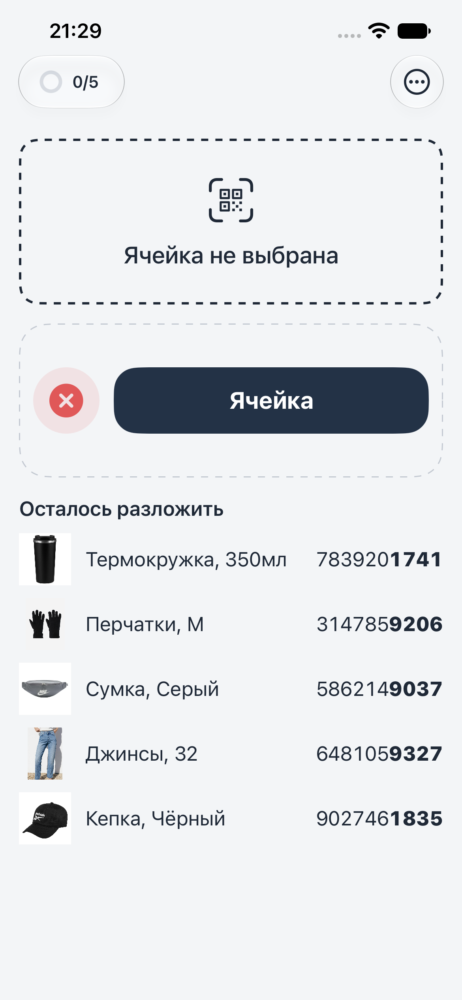
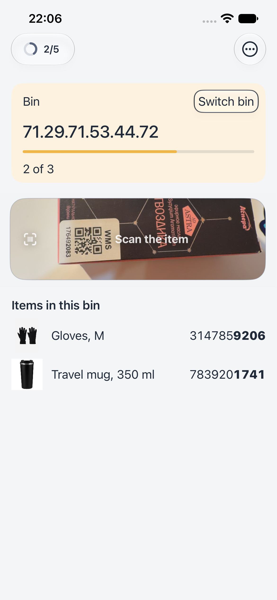
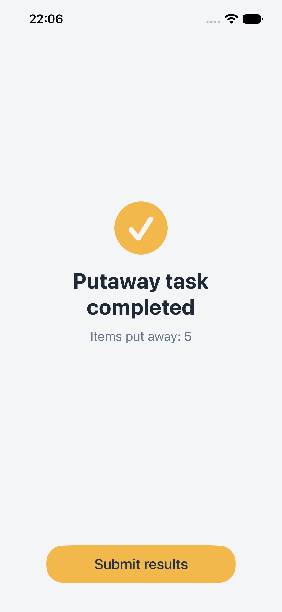
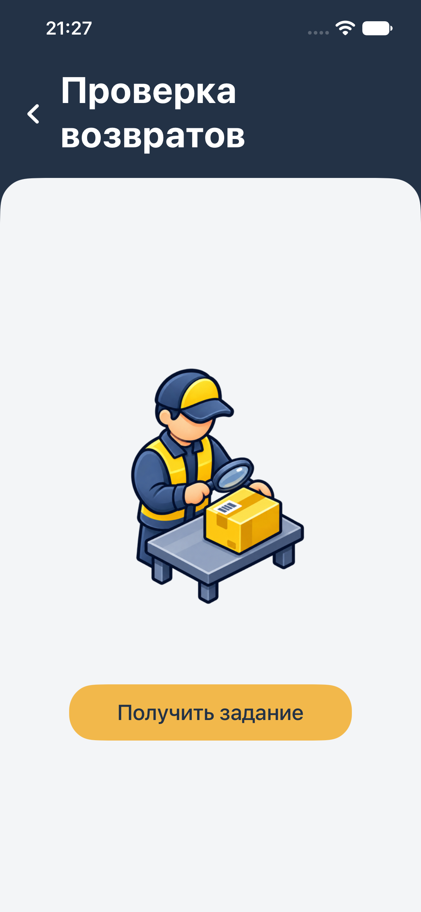
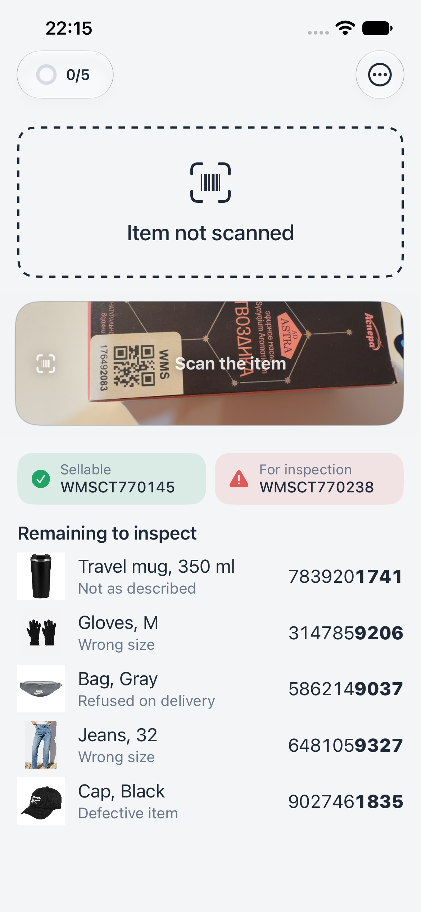
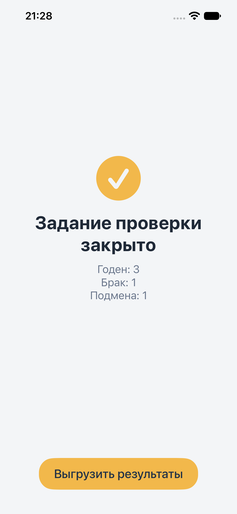
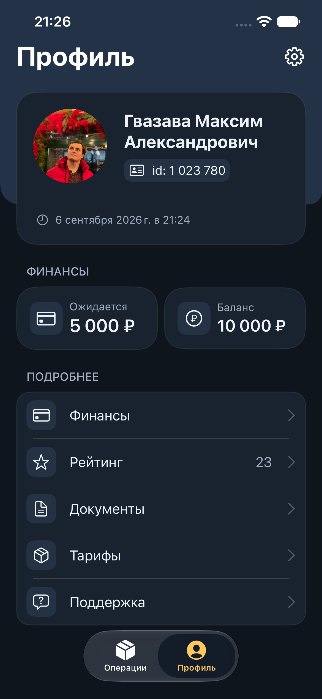
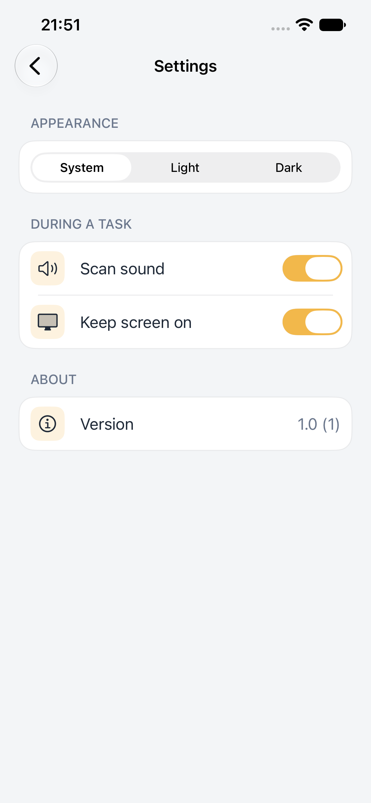

# WMS

| Putaway | Picking | Returns inspection |
|:---:|:---:|:---:|
|  |  |  |
| **Putaway:** place items into freely selected storage cells. | **Picking:** collect items according to the task list. | **Returns inspection:** check returned items and record a decision. |

A SwiftUI app for warehouse operators, with three complete flows: Putaway, Picking, and Returns inspection. Tasks are loaded from bundled mock JSON, progress is saved on the device so an interrupted task resumes where it left off, and completed results are encoded as API-style requests.

The Profile tab covers earnings history, operator ratings, warehouse tariffs, work documents, support chat, and settings. The app supports light and dark themes and comes in Russian and English.

## Project Status

The core app is complete and ready to demo: Putaway, Picking, and Returns inspection work end to end and are covered by ViewModel tests. New features are still added from time to time.

## Screenshots

### Operations menu


### Putaway

| Get task | Choose a cell |
|:---:|:---:|
|  |  |
| **Items in the cell** | **Task complete** |
|  |  |

### Picking

| Get task | Item & scanner | Task complete |
|:---:|:---:|:---:|
|  |  |  |

### Returns inspection

| Get task | Items & containers | Task complete |
|:---:|:---:|:---:|
|  |  |  |

### Profile

| Light theme | Dark theme | Settings |
|:---:|:---:|:---:|
|  |  |  |
| **Finance history** | **Rating** | **Tariffs** |
|  |  |  |
| **Documents** | **Support chat** | |
|  |  | |

## Features

### App

- Warehouse operations menu: Putaway, Picking, Returns inspection.
- One task at a time: once a task is taken, the other operations lock, and the menu marks the open one with Continue task until its results are uploaded.
- Task progress in all three modules is saved on the device with SwiftData, so an interrupted task resumes where it left off, even after the app is closed. Putaway and Returns inspection tasks reopen at the container scan.
- Tab-based app shell with Operations and Profile sections.
- Navigation with `NavigationStack(path:)`.
- `@Observable` ViewModel.
- Camera permission blocker before warehouse operations, with first-run guidance and Settings recovery after denied access.
- Light and dark themes: the app follows the system appearance or the one picked in the settings, and switching cross-fades the whole window.
- Russian and English interface that follows the iOS language setting, down to the item names and return reasons in the mock tasks.
- The home indicator gesture is deferred for as long as a warehouse operation is open, so a swipe near the bottom edge raises the indicator first instead of dropping the operator out of a task.
- The screen is kept awake for the length of a warehouse operation and released on the way out.

### Putaway

- Putaway flow: fetch task, onboarding, scan the container, scan a storage cell, scan items into it, switch cells, finish screen.
- One-time illustrated Putaway onboarding stored with `@AppStorage`, with replay from the container and task menus.
- Container check before the task opens: a card names the container and where it stands in the warehouse, and only the code of that container starts the putaway.
- Free putaway: the task says what to put away, not where. The operator picks a cell and scans its location code.
- Storage cell card with a fill indicator against the cell capacity of the task.
- Item list that switches by phase: items left in the cart before a cell is chosen, items already placed once it is.
- The item just scanned moves to the top of the list, so the list itself confirms the scan.
- An item outside the task is rejected on its first scan and accepted after the same code is scanned again for confirmation; it occupies cell capacity without increasing task progress.
- Re-scanning an item that already lies in the current cell is accepted, while a new placement is rejected when the cell is out of space.
- Task progress in the navigation bar, with a menu breaking it down into placed and untouched items.
- Finish button that appears once the last item is placed, instead of jumping to the finish screen on its own.
- Early finish from the task menu, behind a confirmation dialog, for when the rest of the items cannot be placed.
- API-style finish request encoding with every item-to-cell placement, plus the IDs of the items left unplaced after an early finish.
- Manual debug-only demo controls for walking the container scan, cell selection, and item placement without the camera.

### Picking

- Picking flow: fetch task, onboarding, current item, scan, progress, finish screen.
- One-time illustrated Picking onboarding stored with `@AppStorage`, with replay from the task menu.
- AVFoundation scanner with camera preview embedded in SwiftUI.
- Scan area limited to the visible camera preview.
- Ultra wide camera selection when available, with fallback to the regular camera.
- Circular picking progress indicator in the navigation bar.
- Missing item flow with confirmation and skipped item summary.
- Replacement item mode for collecting an allowed analog item.
- API-style finish request encoding with collected, skipped, and replacement item IDs.
- Manual debug-only demo controls for testing successful and failed collection without the camera.

### Returns inspection

- Returns flow: fetch task, onboarding, scan the returns container, bind the result containers, scan a returned item, review the return reason, choose a decision, photograph the item when required, finish screen.
- One-time illustrated Returns onboarding stored with `@AppStorage`, with replay from the container and task menus.
- Container check before the task opens: a card names the container the returns arrived in and where it stands, and only the code of that container starts the check.
- Two result containers bound by scanning on the same screen, one for good items and one for items going to inspection; a code that is not a container, the source container itself, and a code already bound are all rejected.
- Result containers carried into the task as chips; tapping one switches the scanner to rebinding that container without leaving the task.
- The container to scan next is highlighted with a shimmer on a Liquid Glass card, and a chip being rebound in the task gets the same highlight.
- Item card with the reason the item came back, replaced by a dashed placeholder while nothing is in hand.
- Three decisions per item: back to sale, defect zone, or a wrong item returned. The decision is a tap, not a scan.
- Photo required for the defect and wrong item decisions: the camera opens with a hint written for that decision, and a cancelled shot leaves the item unchecked.
- The shot is downscaled to 2048 px and compressed to JPEG for the request, with a separate thumbnail kept for the list row.
- Scanning the next item is rejected until the item in hand gets a decision.
- The whole task in one list: items left to check on top, checked items below with the newest first and the decision shown as either an icon or a badged photo.
- Re-scanning a checked item takes it back in hand, and a new decision overwrites the old one without moving the progress count.
- Task progress in the navigation bar, with a menu breaking it down into checked and remaining items.
- Finish button that appears once every item is checked and nothing is left in hand.
- Early finish from the task menu, behind a confirmation dialog, for when the rest of the items cannot be checked.
- API-style finish request encoding with a decision and target container per item, a photo when required, plus the IDs of the items left unchecked after an early finish.
- Manual debug-only demo controls for walking the container and item scans without the camera.

### Profile

- Profile screen with AsyncImage avatar, finance cards, reusable detail rows, async mock loading, loading/error states, and pull-to-refresh.
- Rating screen with an interactive Swift Charts line chart, drag selection with a value callout, and a per-operation rating grid with trend indicators.
- Tariffs screen with rates grouped by warehouse zone and a popover filter by zone and operation.
- Documents screen with a PDFKit preview and an acknowledge action that updates the document state through the service.
- Support chat screen with messages that appear instantly and roll back if sending fails, and replies that arrive from the service on a delay.
- Settings screen with a theme picker, switches for the scan sound and for keeping the screen awake during a task, and the app version.

### Shared and data

- Animated error banner in the navigation bar.
- One onboarding component shared by all three modules, with the pages of each module kept as data.
- Camera wrapper around the system camera that hands back a compressed photo and a list thumbnail in one shot.
- System sound feedback for successful and failed scans, which the settings can switch off.
- Semantic color tokens in the asset catalog named by role - background, surface, text, brand, accent - each carrying a light and a dark value, so both themes come from one set of names.
- Liquid Glass on iOS 26 for buttons, error banners, and highlighted cards, with regular fills on earlier versions.
- A shimmer highlight that stays off under Reduce Motion, used for Continue task in the menu and for the containers in Returns inspection.
- Interface strings in a String Catalog under semantic keys, each with a Russian and an English value, used in code through generated symbols such as `.operationsTitle`.
- App settings kept in `UserDefaults` through `@AppStorage`, with defaults registered at launch so readers outside SwiftUI see the same values.
- Mock API-style JSON resources for profile, picking, putaway, and returns task loading, with a Russian and an English copy of each task.
- Mock services for fetching tasks, validating replacements, encoding finish requests, and finishing picking, putaway, and returns tasks.
- Mock items with images, storage locations, articles, stock values, prices, and item attributes.
- Swift Testing coverage for core picking, putaway, and returns ViewModel/result behavior, saved task progress and the one-task lock, tariff grouping and filtering, Profile and Rating ViewModel loading states, and document acknowledgement.

## Main Flows

<details>
<summary>Putaway</summary>

1. Open the Putaway module.
2. Fetch a putaway task.
3. Complete the Putaway onboarding on first launch, or replay it from the container or task menu.
4. Find the container named in the task and scan its code; any other code is rejected.
5. Scan the location code of a storage cell to open it.
6. Hold the camera area to scan an item into the open cell.
7. The scanned item moves to the top of the placed list and the cell fill indicator grows.
8. When the cell is out of space, switch cells and scan the location code of the next one.
9. After the last item is placed, the finish button appears; items that cannot be placed are left behind by finishing early from the task menu.
10. Finish the task through the mock service, which encodes every item-to-cell placement into JSON.

</details>

<details>
<summary>Picking</summary>

1. Open the Picking module.
2. Fetch a picking task.
3. Complete the Picking onboarding on first launch, or replay it from the task menu.
4. Check the item, label ID, and storage location.
5. Hold the camera area to scan.
6. If the scanned code matches the current item, the app moves to the next item.
7. If the item is missing, confirm the skip and continue.
8. If an allowed analog item is found, use replacement mode to collect it.
9. After all items are collected or skipped, the finish screen opens.
10. Finish the task through the mock service, which encodes the result into JSON.

</details>

<details>
<summary>Returns inspection</summary>

1. Open the Returns inspection module.
2. Fetch a returns task.
3. Complete the Returns onboarding on first launch, or replay it from the container or task menu.
4. Find the container the returns arrived in and scan its code; any other code is rejected.
5. Scan a container for good items and a container for items going to inspection.
6. Hold the camera area to scan a returned item.
7. Check the item, its label ID, and the reason it came back.
8. Inspect the item and tap one of the three decisions; until then the next scan is rejected.
9. For the defect and wrong item decisions, photograph the item; the decision is not recorded without a shot.
10. Put the item into the container its decision points to; either container can be swapped mid-task by tapping its chip and scanning a new code.
11. The checked item moves into the checked part of the list and shows its decision as an icon or a badged photo.
12. Re-scan a checked item to take it back in hand and overwrite the decision.
13. After the last item is checked, the finish button appears; unchecked items are left behind by finishing early from the task menu.
14. Finish the task through the mock service, which encodes a decision and container for every checked item, plus a photo when required, into JSON.

</details>

## Tech Stack

- Swift
- SwiftUI
- MVVM
- Observation (`@Observable`)
- AVFoundation
- Swift Charts
- PDFKit
- SwiftData
- String Catalogs
- Swift Testing
- Mock service layer with API-style JSON

## Project Structure

<details>
<summary>Folder tree</summary>

```text
WMS/
├── Features/
│   ├── Operations/
│   │   ├── Picking/
│   │   │   └── PickingTask/
│   │   ├── Putaway/
│   │   ├── Returns/
│   │   └── Shared/
│   └── Profile/
│       ├── Documents/
│       ├── Finance/
│       ├── Rating/
│       ├── Support/
│       └── Tariffs/
├── Models/
│   ├── Operations/
│   ├── Picking/
│   ├── Profile/
│   │   ├── Documents/
│   │   ├── Rating/
│   │   ├── Support/
│   │   └── Tariffs/
│   ├── Putaway/
│   └── Returns/
├── Resources/
│   ├── Assets.xcassets/
│   ├── MockJSON/
│   │   ├── en.lproj/
│   │   └── ru.lproj/
│   └── MockPDF/
├── Services/
├── Shared/
│   └── Components/
│       └── ErrorBanner/
└── Utilities/
```

</details>

Where to start reading:

- `PickingTaskView.swift` - Current item screen and scanner UI.
- `PickingTaskViewModel.swift` - Picking logic and code validation.
- `ScannerPreviewView.swift` - SwiftUI wrapper around the AVFoundation scanner.
- `PickingTaskService.swift` - Picking service protocol and mock implementation.
- `PickingTaskResultRequest.swift` - Encodable API-style request for finishing a picking task.
- `PutawayTaskView.swift` - Storage cell card, scanner, and item list for putaway.
- `PutawayTaskViewModel.swift` - Cell selection, placement, capacity, and placement order.
- `ReturnsContainersView.swift` - Container screen that binds the returns container and the two result containers.
- `ReturnsTaskView.swift` - Return card, decision buttons, and the task list of the returns module.
- `ReturnsTaskViewModel.swift` - Decision recording, photos, container binding, re-checks, and check order.
- `CameraPickerView.swift` - SwiftUI wrapper around the system camera, returning a compressed photo and a thumbnail.
- `PickingProgressStore.swift` - SwiftData store behind a protocol that saves, restores, and clears picking progress; Putaway and Returns follow the same pattern.
- `ActiveTaskStore.swift` - Which operation holds the open task, shared through the environment to lock the rest of the menu.
- `ProfileRatingView.swift` - Swift Charts rating chart with drag selection.
- `TariffsViewModel.swift` - Tariff loading, grouping by zone, and filtering.
- `DocumentPreviewView.swift` - PDF preview with the acknowledge action.
- `SupportService.swift` - Support chat service protocol, with server-initiated messages exposed as an `AsyncStream`.
- `SettingsView.swift` - Theme picker and the switches that change how a task behaves.
- `PDFKitView.swift` - SwiftUI wrapper around PDFKit.
- `ColorPalette.swift` - Semantic color tokens backed by the asset catalog.
- `ShimmerModifier.swift` - Shimmer highlight that respects Reduce Motion.
- `MockJSONLoader.swift` - Helper for decoding bundled mock JSON resources.
- `WMSTests/` - Swift Testing suites for the operation module and the Picking, Putaway, Returns, Tariffs, Profile, Rating, and Documents ViewModels.

## How to Run

1. Open `WMS.xcodeproj` in Xcode.
2. Select an iPhone simulator or a physical device.
3. Use a physical iPhone to test the scanner, because the simulator does not provide a real camera.
4. Run the `WMS` target.

Minimum iOS version: iOS 17. Requires Xcode 26 or later.

## Demo Guide

The repository includes a short demo guide with test item IDs and scanning instructions. It covers only the Picking flow for now; a full guide for all three modules will be added later.

- [English demo guide](assets/Guide_Picking_Flow_EN.pdf)
- [Russian demo guide](assets/Guide_Picking_Flow_RU.pdf)

## Demo Notes

- The mock service includes a test user ID for checking the task fetching error state.
- Profile and warehouse task data are loaded from bundled mock JSON files.
- The picking finish flow encodes collected, skipped, and replacement item IDs into JSON before completing the mock request.
- The putaway finish flow encodes item-to-cell placements the same way, and the returns finish flow encodes a decision and container for every checked item, plus a photo when required.
- The picking, putaway, and returns mock tasks share item IDs, so one set of printed codes works in all three modules. The returns task adds the reason each item came back.
- The putaway and returns tasks open with a container scan, and the container card on screen shows the code the mock task expects. The returns module then takes the good and inspection containers from any two other codes carrying the container prefix.
- Returns demo mode fills the photo step with a placeholder shot, because the simulator has no camera.
- Picking, putaway, and returns onboarding completion is stored locally with `@AppStorage`, one flag per module.
- All three modules replay their onboarding from the menu in the navigation bar.
- All three warehouse modules include debug-only demo controls that replace the camera with buttons, so the flows can be walked in the simulator, where no camera exists.
- Support chat replies come from the mock service on a delay, so the conversation continues without a backend.
- Settings are stored locally with `@AppStorage`: the theme, the scan sound, and whether the screen stays awake during a task.
- Task progress is kept between launches, so a task left open in an earlier run keeps the other operations locked. Finish and upload it to unlock them.
- The demos show the Russian interface and the screenshots show the English one. To switch languages, change the language of WMS in the iOS Settings, or set App Language in the Run options of the Xcode scheme.
- Camera permission handling blocks warehouse operations when camera access is missing.

## Future Improvements

- Expand test coverage for scanner-related edge cases and navigation flows.
- Add an explicit empty task state.
- Add a camera switcher for 0.5x / 1x camera modes.
- Move camera permission blocking to an operation-tab overlay so the Profile tab remains available without camera access.
