# WMS

| Putaway | Picking |
|:---:|:---:|
| 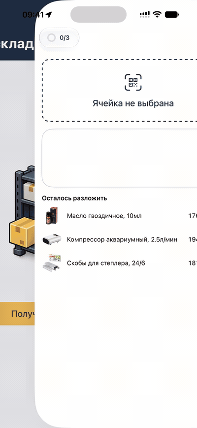 | 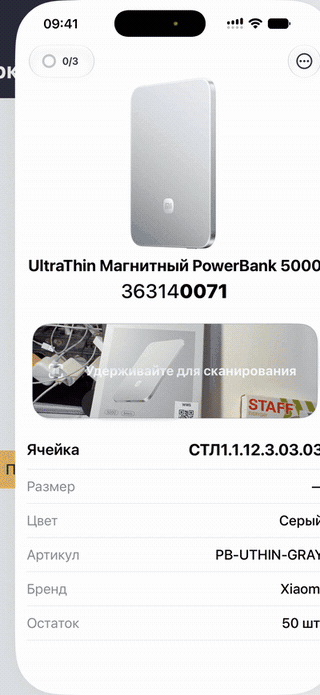 |
| **Putaway:** the operator places items into freely selected storage cells. | **Picking:** the operator collects items according to the task list. |

A warehouse operations app built with SwiftUI. Two warehouse flows are implemented, both driven by API-style mock JSON. In Putaway, an operator receives a task, scans a storage cell, scans items into it one by one, switches cells when one is full, and finishes by encoding where every item ended up. In Picking, the operator receives a task, reviews a short onboarding flow, sees the current item, scans a numeric label code, handles missing or replacement items, moves to the next item, and finishes the task by encoding the result into an API-style JSON request.

Putaway and Picking are the implemented warehouse modules. The Profile tab is the other developed area and covers earnings history, an operator rating chart, warehouse tariffs, work documents, and a support chat. The app is designed to grow into a larger warehouse app with additional modules such as Returns check and other warehouse operations.

## Project Status

In development. Putaway and Picking are both complete end to end and covered by ViewModel tests; Returns check and other warehouse modules are planned.

## Screenshots

| Operations menu | Get task | Item & scanner |
|:---:|:---:|:---:|
| 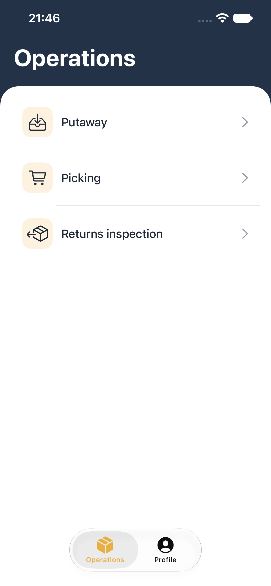 | 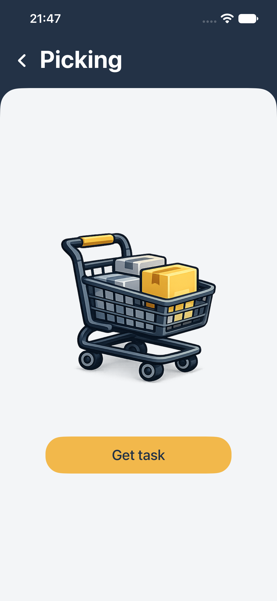 | 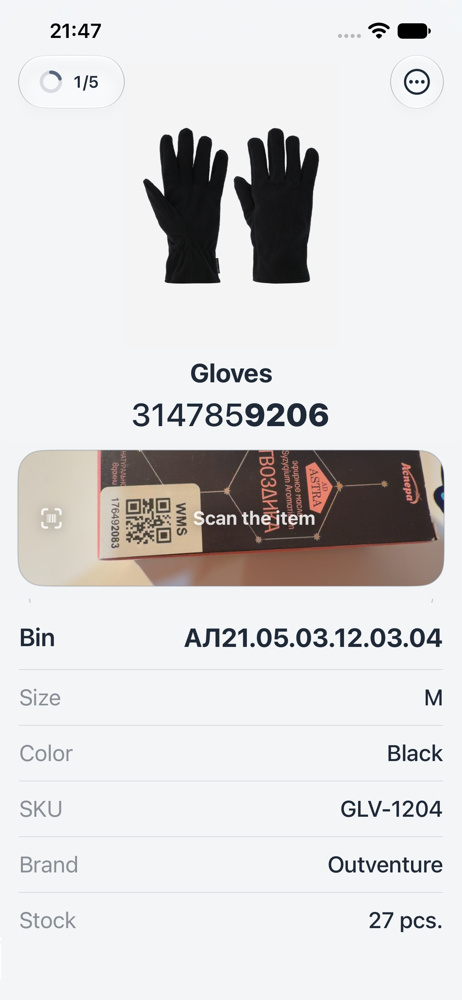 |

| Task complete | Profile | Finance history |
|:---:|:---:|:---:|
| 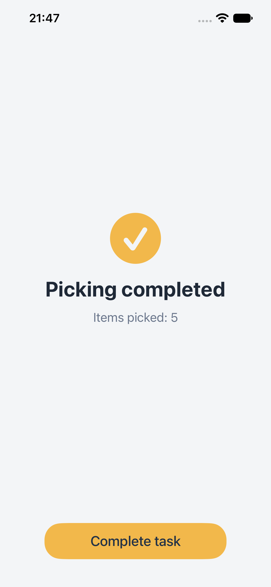 | 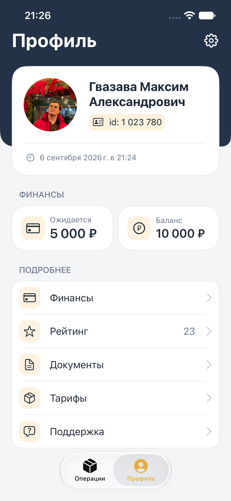 | 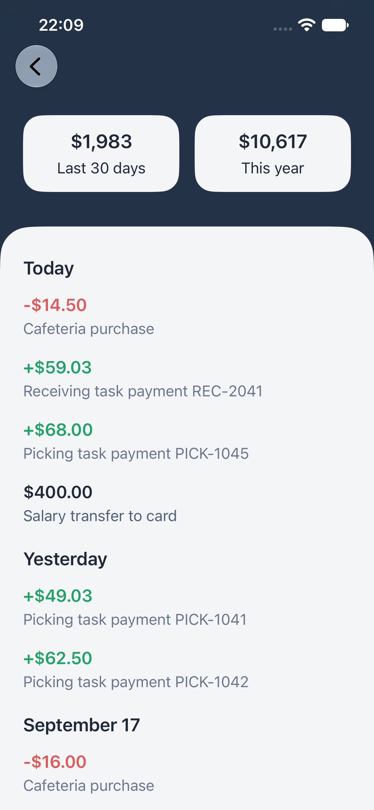 |

| Rating | Documents | Tariffs |
|:---:|:---:|:---:|
| 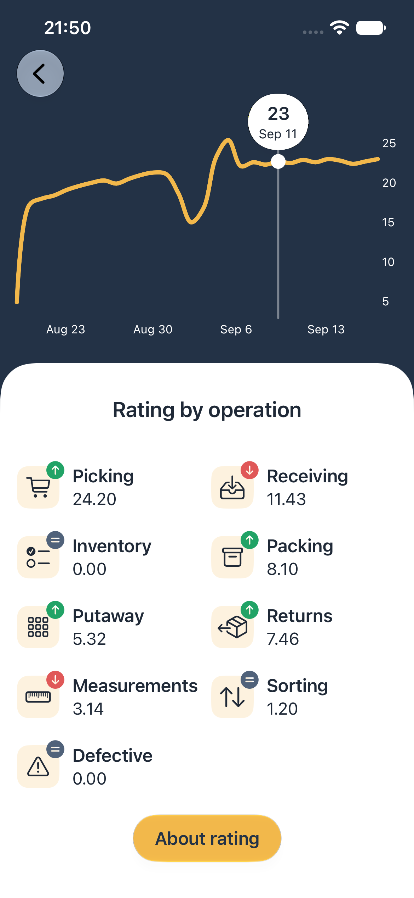 | 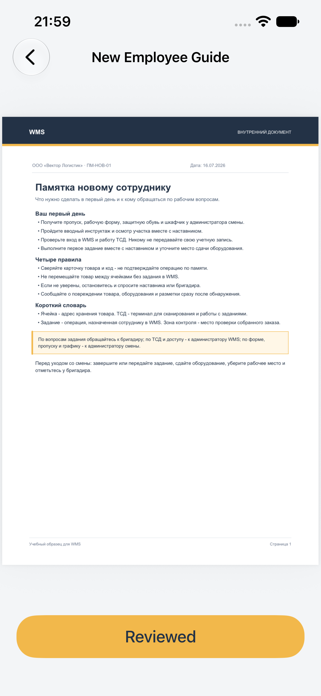 | 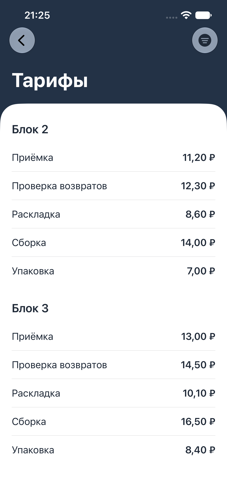 |

| Support chat |
|:---:|
| 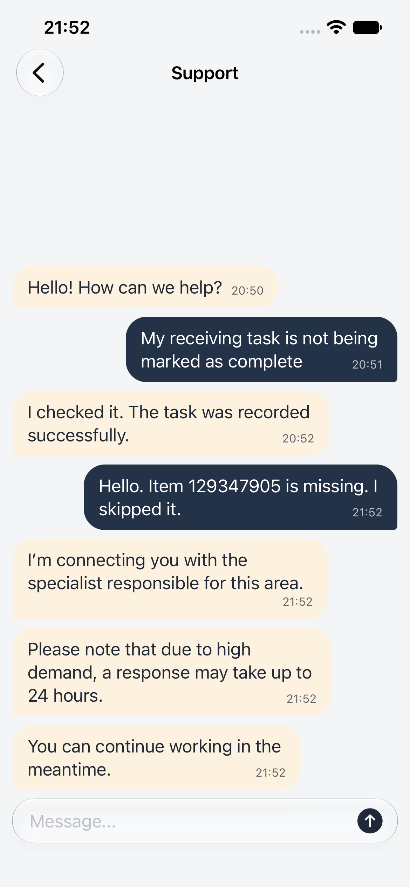 |

## Features

### App

- Warehouse operations menu: Putaway, Picking, Returns check.
- Tab-based app shell with Operations and Profile sections.
- Navigation with `NavigationStack(path:)`.
- `@Observable` ViewModel.
- Camera permission blocker before warehouse operations, with first-run guidance and Settings recovery after denied access.

### Putaway

- Putaway flow: fetch task, scan a storage cell, scan items into it, switch cells, finish screen.
- Free putaway: the task says what to put away, not where. The operator picks a cell and scans its location code.
- Storage cell card with a fill indicator against the cell capacity of the task.
- Item list that switches by phase: items left in the cart before a cell is chosen, items already placed once it is.
- The item just scanned moves to the top of the list, so the list itself confirms the scan.
- Rejection only when the cell is out of space; re-scanning an item that already lies in the current cell is accepted.
- Task progress in the navigation bar, with a menu breaking it down into placed and untouched items.
- Finish button that appears once the last item is placed, instead of jumping to the finish screen on its own.
- Early finish from the task menu, behind a confirmation dialog, for when the rest of the items cannot be placed.
- API-style finish request encoding with every item-to-cell placement, plus the IDs of the items left unplaced after an early finish.

### Picking

- Picking flow: fetch task, onboarding, current item, scan, progress, finish screen.
- One-time illustrated Picking onboarding stored with `@AppStorage`, with replay from the task menu.
- AVFoundation scanner with camera preview embedded in SwiftUI.
- Scan area limited to the visible camera preview.
- Ultra wide camera selection when available, with fallback to the regular camera.
- Circular picking progress indicator in the navigation bar.
- Missing item flow with confirmation and skipped item summary.
- Replacement item mode for collecting an allowed analog item.
- API-style finish request encoding with collected, skipped, and replacement item IDs.
- Manual debug-only demo controls for testing successful and failed collection without the camera.

### Profile

- Profile screen with AsyncImage avatar, finance cards, reusable detail rows, async mock loading, loading/error states, and pull-to-refresh.
- Rating screen with an interactive Swift Charts line chart, drag selection with a value callout, and a per-operation rating grid with trend indicators.
- Tariffs screen with rates grouped by warehouse zone and a popover filter by zone and operation.
- Documents screen with a PDFKit preview and an acknowledge action that updates the document state through the service.
- Support chat screen with messages that appear instantly and roll back if sending fails, and replies that arrive from the service on a delay.

### Shared and data

- Animated error banner in the navigation bar.
- System sound feedback for successful and failed scans.
- Mock API-style JSON resources for profile, picking, and putaway task loading.
- Mock services for fetching tasks, validating replacements, encoding finish requests, and finishing picking and putaway tasks.
- Mock items with images, storage locations, articles, stock values, prices, and item attributes.
- Swift Testing coverage for core picking and putaway ViewModel/result behavior, tariff grouping and filtering, Profile and Rating ViewModel loading states, and document acknowledgement.

## Main Flows

### Putaway

1. Open the Putaway module.
2. Fetch a putaway task.
3. Scan the location code of a storage cell to open it.
4. Hold the camera area to scan an item into the open cell.
5. The scanned item moves to the top of the placed list and the cell fill indicator grows.
6. When the cell is out of space, switch cells and scan the location code of the next one.
7. After the last item is placed, the finish button appears; items that cannot be placed are left behind by finishing early from the task menu.
8. Finish the task through the mock service, which encodes every item-to-cell placement into JSON.

### Picking

1. Open the Picking module.
2. Fetch a picking task.
3. Complete the Picking onboarding on first launch, or replay it from the task menu.
4. Check the item, label ID, and storage location.
5. Hold the camera area to scan.
6. If the scanned code matches the current item, the app moves to the next item.
7. If the item is missing, confirm the skip and continue.
8. If an allowed analog item is found, use replacement mode to collect it.
9. After all items are collected or skipped, the finish screen opens.
10. Finish the task through the mock service, which encodes the result into JSON.

## Tech Stack

- Swift
- SwiftUI
- MVVM
- Observation (`@Observable`)
- AVFoundation
- Swift Charts
- PDFKit
- Swift Testing
- Mock service layer with API-style JSON

## Project Structure

<details>
<summary>Folder tree</summary>

```text
WMS/
├── Features/
│   ├── Operations/
│   │   ├── Picking/
│   │   │   └── PickingTask/
│   │   ├── Putaway/
│   │   ├── Returns/
│   │   └── Shared/
│   └── Profile/
│       ├── Documents/
│       ├── Finance/
│       ├── Rating/
│       ├── Support/
│       └── Tariffs/
├── Models/
│   ├── Operations/
│   ├── Picking/
│   ├── Profile/
│   │   ├── Documents/
│   │   ├── Rating/
│   │   ├── Support/
│   │   └── Tariffs/
│   └── Putaway/
├── Resources/
│   ├── Assets.xcassets/
│   ├── MockJSON/
│   └── MockPDF/
├── Services/
├── Shared/
│   └── Components/
└── Utilities/
```

</details>

Where to start reading:

- `PickingTaskView.swift` - Current item screen and scanner UI.
- `PickingTaskViewModel.swift` - Picking logic and code validation.
- `ScannerPreviewView.swift` - SwiftUI wrapper around the AVFoundation scanner.
- `PickingTaskService.swift` - Picking service protocol and mock implementation.
- `PickingTaskResultRequest.swift` - Encodable API-style request for finishing a picking task.
- `PutawayTaskView.swift` - Storage cell card, scanner, and item list for putaway.
- `PutawayTaskViewModel.swift` - Cell selection, placement, capacity, and placement order.
- `ProfileRatingView.swift` - Swift Charts rating chart with drag selection.
- `TariffsViewModel.swift` - Tariff loading, grouping by zone, and filtering.
- `DocumentPreviewView.swift` - PDF preview with the acknowledge action.
- `SupportService.swift` - Support chat service protocol, with server-initiated messages exposed as an `AsyncStream`.
- `PDFKitView.swift` - SwiftUI wrapper around PDFKit.
- `MockJSONLoader.swift` - Helper for decoding bundled mock JSON resources.
- `WMSTests/` - Swift Testing suites for the Picking, Putaway, Tariffs, Profile, Rating, and Documents ViewModels.

## How to Run

1. Open `WMS.xcodeproj` in Xcode.
2. Select an iPhone simulator or a physical device.
3. Use a physical iPhone to test the scanner, because the simulator does not provide a real camera.
4. Run the `WMS` target.

Minimum iOS version: iOS 17.

## Demo Guide

The repository includes a short picking demo guide with test item IDs and scanning instructions:

- [English demo guide](assets/Guide_Picking_Flow_EN.pdf)
- [Russian demo guide](assets/Guide_Picking_Flow_RU.pdf)

## Demo Notes

- The mock service includes a test user ID for checking the task fetching error state.
- Profile and picking task data are loaded from bundled mock JSON files.
- The picking finish flow encodes collected, skipped, and replacement item IDs into JSON before completing the mock request.
- The putaway finish flow encodes item-to-cell placements the same way.
- The picking and putaway mock tasks share item IDs, so one set of printed codes works in both modules.
- Picking onboarding completion is stored locally with `@AppStorage`.
- The task menu includes debug-only demo controls and an onboarding replay action for local testing.
- Support chat replies come from the mock service on a delay, so the conversation continues without a backend.
- The settings entry point is hidden until the app has configurable options.
- Camera permission handling blocks warehouse operations when camera access is missing.
- Returns check and other warehouse operations are planned as future modules.

## Future Improvements

- Expand test coverage for scanner-related edge cases and navigation flows.
- Add an explicit empty task state.
- Add a camera switcher for 0.5x / 1x camera modes.
- Move camera permission blocking to an operation-tab overlay so the Profile tab remains available without camera access.
